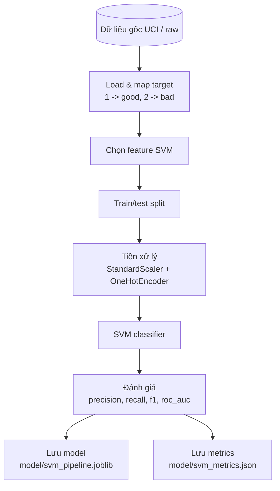
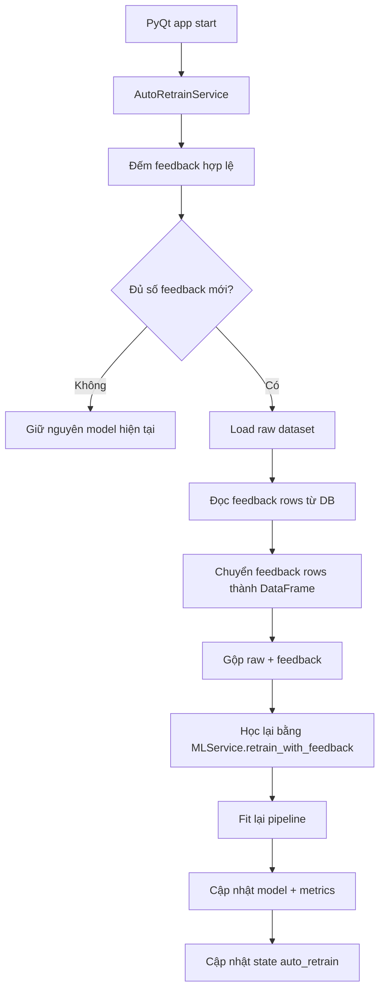

# Về việc lựa chọn các bộ thuộc tính

Trong số 20 thuộc tính từ bộ dữ liệu của UCI [Link](https://archive.ics.uci.edu/dataset/144/statlog+german+credit+data):

| Tên cột                 | Attr | Loại        | Mô tả & Giá trị                                                                |
| ----------------------- | ---- | ----------- | ------------------------------------------------------------------------------ |
| status                  | 1    | Categorical | Số dư tài khoản: A11 (<0 DM), A12 (0–200 DM), A13 (≥200 DM), A14 (không có TK) |
| duration                | 2    | Numerical   | Thời hạn vay (tháng)                                                           |
| credit_history          | 3    | Categorical | A30 (không vay/đã trả hết), A31–A34 (các mức lịch sử tín dụng)                 |
| purpose                 | 4    | Categorical | A40–A410: xe mới, xe cũ, nội thất, điện tử, sửa chữa, giáo dục, kinh doanh...  |
| credit_amount           | 5    | Numerical   | Số tiền vay (DM)                                                               |
| savings                 | 6    | Categorical | A61–A65: <100 DM đến ≥1000 DM hoặc không có                                    |
| employment              | 7    | Categorical | A71 (thất nghiệp), A72–A75 (<1 năm đến ≥7 năm làm việc)                        |
| installment_rate        | 8    | Numerical   | Tỷ lệ trả góp / thu nhập (%)                                                   |
| personal_status         | 9    | Categorical | Kết hợp giới tính và tình trạng hôn nhân                                       |
| other_debtors           | 10   | Categorical | A101 (không có), A102 (đồng vay), A103 (bảo lãnh)                              |
| residence_since         | 11   | Numerical   | Số năm cư trú hiện tại                                                         |
| property                | 12   | Categorical | A121 (BĐS), A122 (bảo hiểm), A123 (xe/khác), A124 (không có)                   |
| age                     | 13   | Numerical   | Tuổi (năm)                                                                     |
| other_installment_plans | 14   | Categorical | A141 (ngân hàng), A142 (cửa hàng), A143 (không có)                             |
| housing                 | 15   | Categorical | A151 (thuê), A152 (sở hữu), A153 (miễn phí)                                    |
| existing_credits        | 16   | Numerical   | Số khoản vay hiện có                                                           |
| job                     | 17   | Categorical | A171–A174: không việc → chuyên gia cao cấp                                     |
| people_liable           | 18   | Numerical   | Số người phụ thuộc                                                             |
| telephone               | 19   | Categorical | A191 (không), A192 (có)                                                        |
| foreign_worker          | 20   | Categorical | A201 (có), A202 (không)                                                        |

Nhóm đã chọn ra các bộ thuộc tính cho từng thuật toán như sau:

## Thuật toán SVM

1. Các thuộc tính bắt buộc

| Feature          | Lý do                                |
| ---------------- | ------------------------------------ |
| status           | Số dư tài khoản – tín hiệu mạnh nhất |
| credit_history   | Phân biệt rõ các mức lịch sử         |
| credit_amount    | Biến liên tục, dễ phân tách          |
| duration         | Scale tốt, quan trọng                |
| savings          | Có thứ bậc rõ                        |
| installment_rate | % thu nhập                           |
| age              | Ổn định                              |
| employment       | Có thứ tự rõ                         |
| other_debtors    | Ảnh hưởng rủi ro                     |

2. Loại bỏ

| Feature         | Lý do                   |
| --------------- | ----------------------- |
| purpose         | Quá nhiều category (11) |
| residence_since | Nhiễu                   |
| people_liable   | Tương quan yếu          |
| telephone       | Không còn ý nghĩa       |
| foreign_worker  | Gần như constant        |

## Thuật toán RF

1. Các thuộc tính bắt buộc

| Feature                 | Lý do                    |
| ----------------------- | ------------------------ |
| status                  | Tín hiệu mạnh nhất       |
| credit_history          | Lịch sử trả nợ           |
| credit_amount           | Số tiền vay              |
| duration                | Thời hạn                 |
| savings                 | Số dư                    |
| installment_rate        | % thu nhập               |
| age                     | Tuổi                     |
| employment              | Kinh nghiệm              |
| purpose                 | RF xử lý tốt categorical |
| property                | Tài sản                  |
| other_debtors           | Bảo lãnh                 |
| housing                 | Tình trạng nhà           |
| other_installment_plans | Nghĩa vụ khác            |
| existing_credits        | Số khoản vay             |
| job                     | Nghề nghiệp              |

2. Loại bỏ

| Feature         | Lý do                |
| --------------- | -------------------- |
| residence_since | Không liên quan mạnh |
| people_liable   | Tương quan yếu       |
| telephone       | Không có ý nghĩa     |
| foreign_worker  | Bias + gần constant  |

## Thuật toán Logistic Regression

1. Các thuộc tính bắt buộc

| Feature                 | Lý do                  |
| ----------------------- | ---------------------- |
| status                  | Tín hiệu mạnh          |
| credit_history          | Có thứ tự rõ           |
| duration                | Thay thế credit_amount |
| savings                 | Ordinal                |
| installment_rate        | Ít tương quan          |
| age                     | Độc lập                |
| employment              | Ordinal                |
| other_debtors           | Tác động rõ            |
| housing                 | Tình trạng nhà         |
| other_installment_plans | Nghĩa vụ tài chính     |

2. Loại bỏ

| Feature         | Lý do                   |
| --------------- | ----------------------- |
| purpose         | One-hot quá nhiều chiều |
| personal_status | Dễ bias                 |
| telephone       | Không ý nghĩa           |
| foreign_worker  | Gần constant            |
| residence_since | Nhiễu                   |
| people_liable   | Yếu                     |

### Những thuộc tính không được đề cập (tức loại bỏ)

| Feature         | Lý do                          | Loại        |
| --------------- | ------------------------------ | ----------- |
| residence_since | Không phản ánh khả năng trả nợ | Numerical   |
| people_liable   | Ảnh hưởng gián tiếp, yếu       | Numerical   |
| telephone       | Dataset cũ, không còn ý nghĩa  | Categorical |
| foreign_worker  | 97% giống nhau → useless       | Categorical |

# Lý thuyết về đa cộng tuyến (multicollinearity)

1. Khái niệm: Đa cộng tuyến (multicollinearity) xảy ra khi các biến độc lập (features) có tương quan tuyến tính mạnh với nhau

* Ví dụ trong German Credit: credit_amount ≈ duration × installment_rate => mang cùng thông tin

2. Mức ảnh hường tới các thuật toán:

| Model               | Ảnh hưởng       |
| ------------------- | --------------- |
| Logistic Regression | RẤT NHẠY        |
| Linear Regression   | RẤT NHẠY        |
| SVM                 | trung bình      |
| Random Forest       | hầu như không   |

# One-hot encoding

Cách thức hoạt động:

* Với mỗi giá trị duy nhất trong cột dữ liệu, One-hot encoding sẽ tạo ra một cột mới:
    * Giá trị nào xuất hiện thì cột tương ứng sẽ được đánh số 1.
    * Các cột còn lại sẽ được đánh số 0.

Ví dụ - dữ liệu bảng động vật:

| ID |  Con  |
| -- | ----- |
| 1  | Chó   |
| 2  | Mèo   |
| 3  | Bò    |

Sau khi One-shot encoding:

| ID |  Chó  |  Mèo  |  Bò   | 
| -- | ----- | ----- | ----- |
| 1  |   1   |   0   |   0   |
| 2  |   0   |   1   |   0   |
| 3  |   0   |   0   |   1   |

# Pipeline training

# Pipeline học lại

